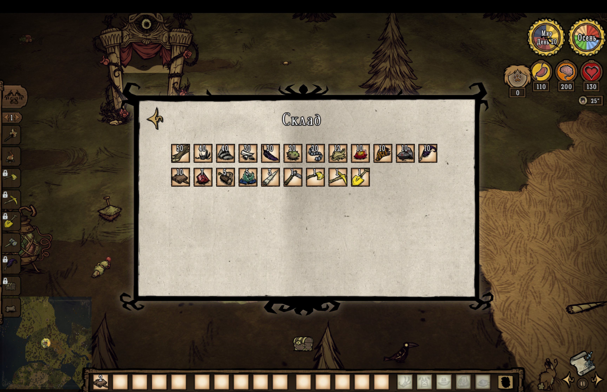

# Storage Viewer

A Don't Starve Together mod that adds a quick Storage panel to view aggregated item counts from marked nearby containers

## Features

- Adds a HUD button and hotkey to open the Storage panel
- Shows item icons with total counts across tracked containers
- Treats containers near minisigns as storage containers
- Syncs storage data from server to client via mod RPC

## How Storage Detection Works

- Server tracks supported container prefabs
- A container is considered part of storage when a minisign is found nearby
- Item counts are aggregated on the server and sent to the client UI

## Configuration

| Setting label | Description | Values and default |
| --- | --- | --- |
| `Debug Logs` | Enables extra debug output in client and server logs | `Disabled` or `Enabled` Default: `Disabled` |
| `Storage Sign Radius` | Defines how far from a container the mod searches for a minisign | `1` to `4` Default: `2` |
| `Track Treasure Chest` | Enables tracking for treasure chests | `Enabled` or `Disabled` Default: `Enabled` |
| `Track Ice Box` | Enables tracking for ice boxes | `Enabled` or `Disabled` Default: `Enabled` |
| `Track Salt Box` | Enables tracking for salt boxes | `Enabled` or `Disabled` Default: `Enabled` |
| `Track Scaled Chest` | Enables tracking for scaled chests | `Enabled` or `Disabled` Default: `Enabled` |
